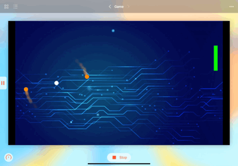
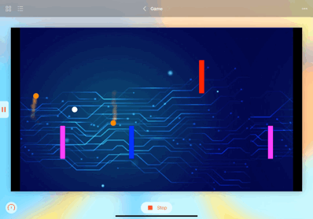

 

 ---

# About Twister 🌪

 This is an endless sidescrolling game, where your one and only goal is to dodge the incoming blocks. But there's a **TWIST**: you can't move your character up and down! Instead, you must harness the power of 🌀rotation🌀 to swerve between obstacles. Be warned, the game only gets harder as you progress!

### Developed by: Avery Vine

 [Website](https://averyvine.com) - [GitHub](https://github.com/AveryVine)

 ---

# How to Play

### The Blocks Are Coming! 🚨

 The blocks are coming! Your goal, as the mysterious, perpetually rotating dots 🔴, is to avoid the incoming blocks at all costs! They will spawn on the right side of the screen, and you must try to get past them. How, you ask? Look no further than the next set of instructions!

 

### Tap to Switch Rotation 🔄

 There is a unique trait to these blocks: they never come in pairs. This means, with careful timing, you can swap your direction of rotation (by tapping the screen), and swerve right between them!

 

### Speed, Deception, and More! 💨

 Watch out! At various points throughout the game, it will become more difficult to survive. Watch out for things like your character moving up and down, blocks increasing speed, or even blocks switching to different heights at the last second!

 

 ---

## Good Luck!
